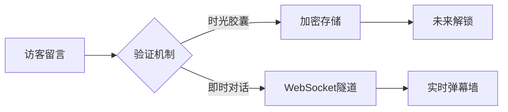

# 🌌 灵思宇宙 - 个人数字花园

> 思维碎片回收站 × 美学实验田 × 开放式精神洞穴

[](https://vitejs.dev/)[](https://vuejs.org/)[](https://www.typescriptlang.org/)[](LICENSE)[](https://spring.io/projects/spring-boot)[](https://www.mysql.com/)[](https://redis.io/)[](https://mybatis.plus/)

<p align="center">
  
</p>

## 🌟 项目亮点

- **意识流导航系统**：非线性内容探索体验
- **赛博禅意美学**：动态粒子背景 × 极简主义交互
- **思维可视化引擎**：多维知识图谱展示
- **跨次元留言系统**：时间胶囊式树洞交互
- **开放源代码哲学**：完整开发工作流透明化

## 🚀 核心功能矩阵

### 🏠 精神原野（首页）
- 量子态个人签名
- 思维波动可视化仪表盘
- 多维度人格拼图
- 实时灵感捕捉器

### 🎨 美学反应堆
| 维度         | 特色功能                     |
| ------------ | ---------------------------- |
| **电影宇宙** | 胶片时间轴 × 导演语言分析器  |
| **书影迷宫** | 跨媒介叙事图谱 × 文学DNA解析 |
| **音乐粒子** | 声波可视化 × 情绪频谱分析    |
| **次元裂缝** | 二维→三维跨次元画廊          |

### 📚 认知工坊
- 碎片化学习晶体
- 知识拓扑网络
- 认知升级日志
- 反常识思维武器库

### 💬 量子树洞


### 👤 元人格画像

- 技能森林可视化
- 人生版本变更日志
- 精神熵值监测仪
- 多平行宇宙分身系统

## 🛠️ 技术架构

### 前端次元
```bash
📦 src
├── 🌌 core # 核心逻辑
├── 🎭 atoms # 状态管理粒子
├── 🖼️ galaxy # 视觉引擎
├── 📡 api # 跨次元通信
├── 🧪 labs # 实验性功能
└── 🗃️ types # 时空类型定义
```

**技术矩阵**：

- Vue 3.4 + Composition API
- TypeScript 5.0 + Volar
- Three.js 思维可视化引擎
- GSAP 时空动画系统
- Markdown 量子解析器

### 后端视界

- SpringBoot 3.4.0+
- MySQL
- Redis
- MyBatis Plus


### 部署（规划中）

```python
class DigitalGarden:
    def __init__(self):
        self.memory_cache = RedisCluster()  # 记忆碎片缓存
        self.thought_engine = NLPProcessor() # 自然语言炼金术
        self.security_layer = QuantumAuth() # 量子加密层
```

## 🧬 本地时空折叠

1. **克隆平行宇宙**
```bash
git clone https://github.com/your-cosmos.git
```

2. **安装时空曲率**
```bash
pnpm install --time-warp
```

3. **启动量子服务器**
```bash
pnpm dev --port 7070
```

4. **构建时空胶囊**
```bash
pnpm build --compress-timeline
```

## 🤝 加入宇宙演化

欢迎通过以下方式参与创造：
1. 在Issues开启平行宇宙讨论
2. 提交Pull Request进行时空修正
3. 通过GitHub Discussions发起哲学辩论
4. 遵循[贡献者公约](CODE_OF_CONDUCT.md)

## 🌐 星际导航
- [世界观白皮书](docs/COSMOS_VISION.md)
- [美学设计系统](docs/DESIGN_GALAXY.md)
- [API星图](docs/API_STARMAP.md)

## License
[MIT 时空许可证](LICENSE) © 2024 [你的名字]


**设计哲学**：
1. 使用科技隐喻构建神秘感
2. 融入ASCII艺术和Mermaid图表
3. 模块化信息展示方式
4. 保持专业性的游戏化表达
5. 强调项目的演进可能性

可以根据实际项目情况调整：
- 增加实际项目截图
- 补充具体技术实现细节
- 完善贡献指南部分
- 添加CI/CD徽章
- 扩展路线图章节


## TODO LIST

暂无